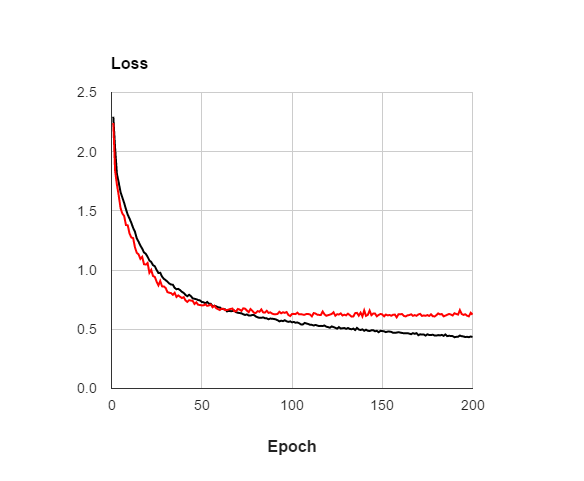
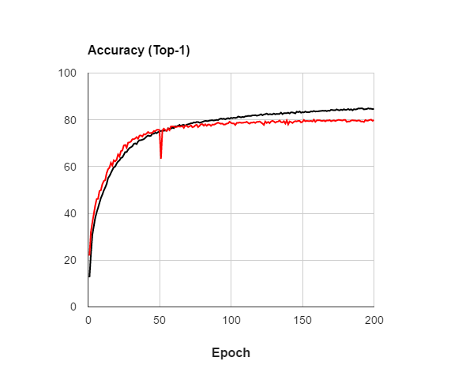

#EE735 Computer Vision RCV Deep Learning Practice \#1: Multi-Class Single-Label Image Classification.
## Task 1. Build an initial framework
This frame work is used as a base for all the DL practices.
This framework supports 1) **multi-thread data loading**, 2) **data pre-fetching**, and 3) **multi-GPU training**. 
Since this is quite general, you can directly utilize it for your research after this practice.
- **DB generator** (`ROOT/db/CIFAR10.lua`) 
To use a specific dataset in this framework, you need to extract the information needed for learning from the dataset.
In practice #1, we use [CIFAR-10](https://www.cs.toronto.edu/~kriz/cifar.html) dataset for the classification task, so you have to fill in the blanks in `ROOT/db/CIFAR10.lua`
If you want to use another dataset, you can add the script for that to `ROOT/db/`. 
- **Task manager** (`ROOT/task/slcls.lua`) 
Task manager defines and provides all interfaces except network training and validation. 
The task manager, for example, defines a network and provides a mini-batch to train the network.
These interfaces are task specific, so if you want to do a new task, you need to create and add a new task manager to `ROOT/task/`.
In this practice, your task is the single label classification (SLCLS), so you must fill in the blanks in `ROOT/task/slcls.lua`. 
- **Teacher** (`ROOT/train.lua`) 
Teachers only receive training mini-batches from the task manager to train and evaluate a given network. 
In other words, it is completely separated from any particular tasks, so once completed, you do not have to touch it anymore.
You must fill in the blanks in `ROOT/train.lua` 

- **Evaluator** (`ROOT/val.lua`) 
The evaluator only takes validation mini-batches from the task manager and evaluates the given network.
Like the teacher, it is completely separated from a particular task, so once completed, you do not have to touch it anymore.
You must fill in the blanks in `ROOT/val.lua` 

Once you have completed the initial framework, make sure you get a **79~80% top-1** accuracy on the validation set with the default parameters. The following two figures show the learning curve. The black curve is for training while the red one is for validation.
Also, make sure that your data loading time is close to **zero**. 

## Task 2. Take a look at the overfitting problem
We examine several factors related to overfitting. 
In each experiment, learn the network until the validation accuracy converges sufficiently.
- Performance comparison when the weight decay is default and 0. 
- Performance comparison when the dropout ratio is default and 0. 
- Performance comparison with and without the data-augmentation. 
- Performance comparison between default and doubled filter count. 

## Task 3. Take a look at various loss functions
We compare the classification performance to various loss functions and analyze what is the most appropriate loss for the signle-label classification task.
In each experiment, learn the network until the validation accuracy converges sufficiently. 
- Performance with Log-softmax loss. 
- Performance with Hinge loss. 
- Performance with L2 loss. (Classification by regression) 

## Task 4. Convergence speed
We examine the factors that affect the convergence speed.
In each experiment, learn the network until the validation accuracy converges sufficiently. 
- Number of required epochs when the learning rate is default and 10-times smaller than the default. 
- Number of required epochs with and without the batch normalization. 

## Getting started
1. Prepare for your environment. 
Ubuntu 14.04 or 16.04 is strongly recommanded.
You must have at least one NVIDIA graphic card of which is higher than GTX580 series.
(e.g. GTX 7xx, GTX TITAN Black, GTX TITAN X, ...)
2. Install [Torch7](http://torch.ch/)
3. Clone this repository to your workspace. 
`$ git clone https://github.com/cvpa3/dl-practice.git /path/to/your/workspace/` 
This repository is large because it include CIFAR-10 dataset in `ROOT/data/db/CIFAR10.tar`. 
4. Extract the dataset. 
`$ cd ROOT/data/db/` 
`$ tar xvf CIFAR10.tar` 
5. Make sure you have 60,000 images in total. 
`$ cd ROOT/data/db/CIFAR10/images/` 
`$ ls -l | grep .jpg | wc -l` 
In the original CIFAR-10, images are not stored as files, but are stored in 6 batch files of 10,000-size . 
In this practice, the TA stores each image as an image file so that you can experience multi-thread data loading and data prefetching.
6. Everything is ready. Start with `ROOT/main.lua`. All details regarding the implementation are commented out in the skeleton code.
7. You can run the code by `$ ./run_p1.sh`. 

## Notes
- All the intermediate outputs generated while the code is executing, such as a DB, a RGB mean and trained models, are stored in `ROOT/data/cache/`. This skeleton always checks to see if there is an output, and if so, it loads.
- When the learning curve converges, the weight decay technique that continues learning with a 10 times smaller learing rate  could be used for further improvements. To do the weight decay, add the following options and run it again. 
`-startFrom /path/to/the/converged/network/file -learnRate <decreased learning rates>`.

## Debugging
Lua does not have a built-in debugger. 
It is strongly recommended to install and use a separate debugger created by Facebook called [fb.debugger](https://github.com/facebook/fblualib/blob/master/fblualib/debugger/README.md).
To use this you need to install Facebook Lua library called [fblualib](https://github.com/facebook/fblualib).
For comfortable debugging, turn off the multi-thread data loading by the option `-numDonkey 0`.

##Open discussion channel
You can utilize [Issues](https://github.com/cvpa3/dl-practice/issues) board as a channel for open discussion. 
Do not feel embarrassed to ask! 
If you have any questions regarding the PA, post in this board. 
Others, who can give a tip to the questions, reply to the questions. 
There is no limitation on the discussion subjects.
- **Extra credits** will be given to those who actively participate in discussions, especially to those who actively answer to other students' questions.
- When posting (both questions and answers), please write your student id so I can give credits.
- When you post a reply, **do not copy and paste your source code**.
- If there is a bug in the skeleton code, or if you have any suggestions, send a "Pool request" to TA. TA will also give him an extra score.

## Report
The report MUST contain the following items and their discussion/analysis/comparison. 
Explanation of your understanding of each step is **not necessary** but deep discussion/analysis/comparison about the results will be dominant for your grade. 
- Task 1) Loss-epoch plot and accuracy-epoch plot for the baseline. 
- Task 2) Loss-epoch plot and accuracy-epoch plot for each experiment. 
- Task 3) Loss-epoch plot and accuracy-epoch plot for each experiment. 
- Task 4) Loss-epoch plot and accuracy-epoch plot for each experiment. 

**Note**, each plot should include both of the training curve and the validation curve such as the above example plots. 

##Submission
The due date is November 25, 2016.
Submit the following attachments to `dgyoo@rcv.kaist.ac.kr`.
- Source codes: `IDXXXXXXXX.zip`
- A report: `IDXXXXXXXX.pdf`
